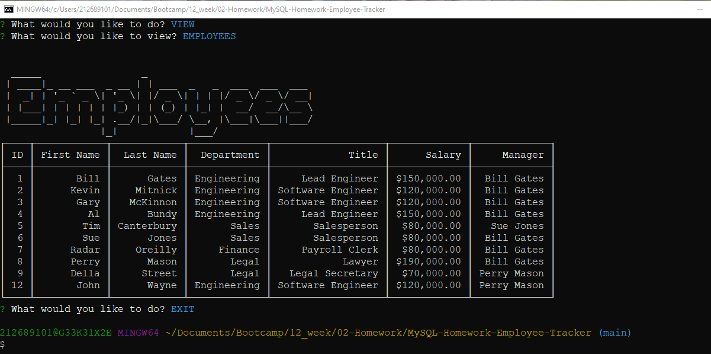
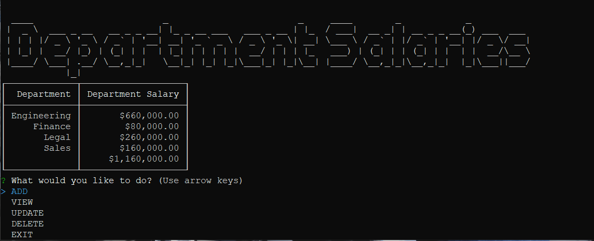

# MySQL-Homework-Employee-Tracker

## Description 

Developers are often tasked with creating interfaces that make it easy for non-developers to view and interact with information stored in databases. Often these interfaces are known as Content Management Systems. In this homework assignment, your challenge is to architect and build a solution for managing a company's employees using node, inquirer, and MySQL.

### App working example

   
[Youtube Video Link of App looks good if use HD](https://youtu.be/aPUk7Up_62c)

### App Screen Shots

   

## Table of contents

- [Description](#Description)
- [App Working Example](#Description)
- [Installation](#Installation)
- [Usage](#Usage)
- [Licence](#Licence)
- [Repository Link](#Repository)

## Installation
Run:

                npm i

## Usage

This command-line application allows the user to:

  * Add departments, roles, employees

  * View departments, roles, employees, employees by manager, department salaries

  * Update employee roles

  * Update employee managers

  * Delete departments, roles, and employees

The application will be invoked with the following command:

                node app.js

## Licence

## Repository

- [Project Repository](https://github.com/rich30041/MySQL-Homework-Employee-Tracker)